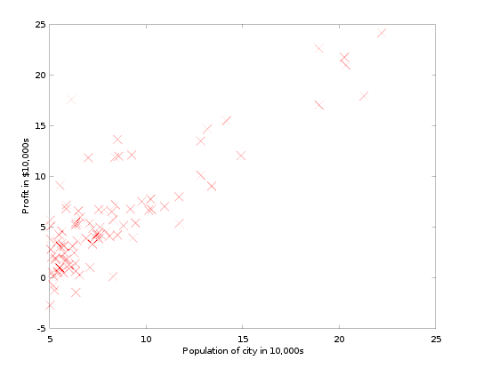
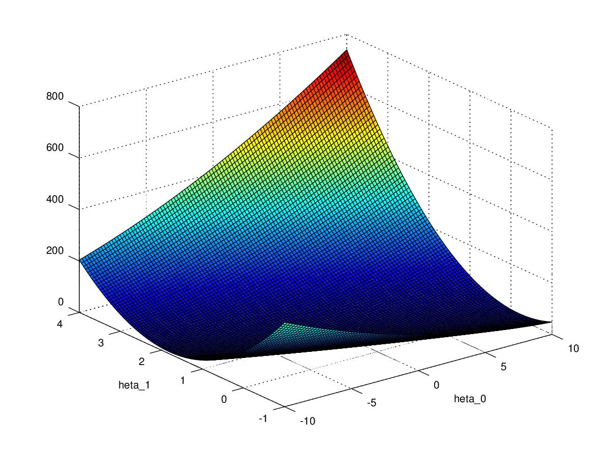
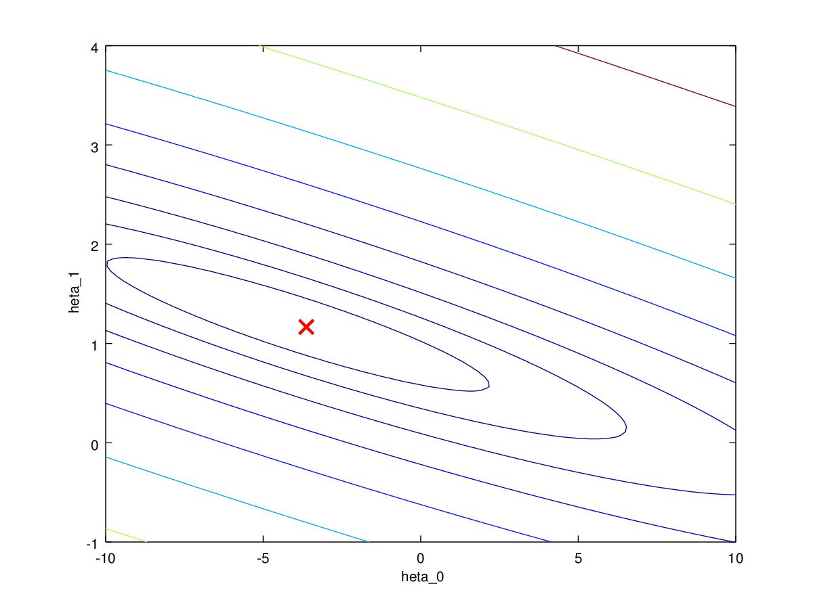
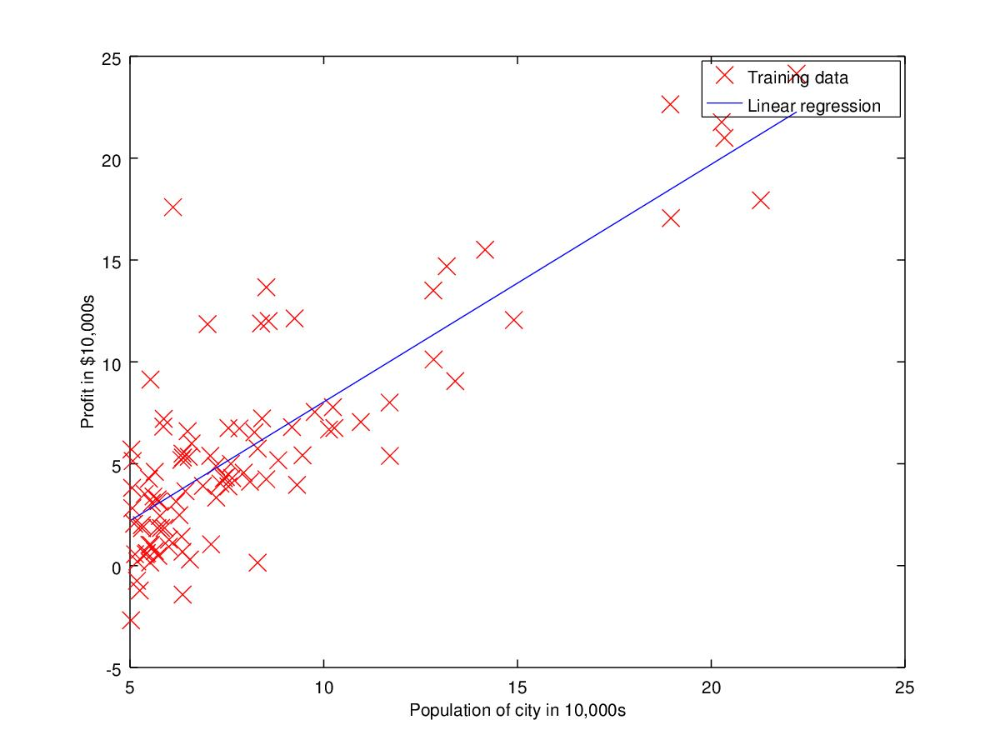

# Linear Regression
## Linear regression with one variable

Implemented linear regression with one variable to predict profit for a food truck and we have data for profits and populations from the cities.
Have to use this data to select which city to expand to next.

### Dataset
* Feature : x (Citi population)
* Targetvariable : y (Profit)
* Dataset size :

### Plotting the data
Below code written in [ex1.m](ex1/ex1.m#L40)
```
data = load('ex1data1.txt');
X = data(:, 1); y = data(:, 2);
m = length(y);
```
Code written in [plotData.m](ex1/plotData.m#L19)
```
plot(x, y, 'rx', 'MarkerSize', 10);
ylabel('Profit in $10,000s');
xlabel('Population of City in 10,000s');

```
</img>
## Gradient Descent 
</img>
</img>

## Linear regression line on the data
</img>

